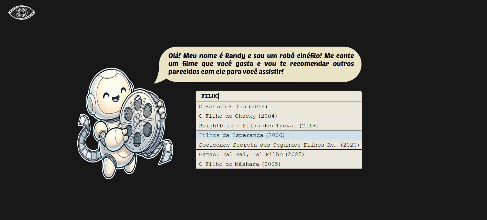
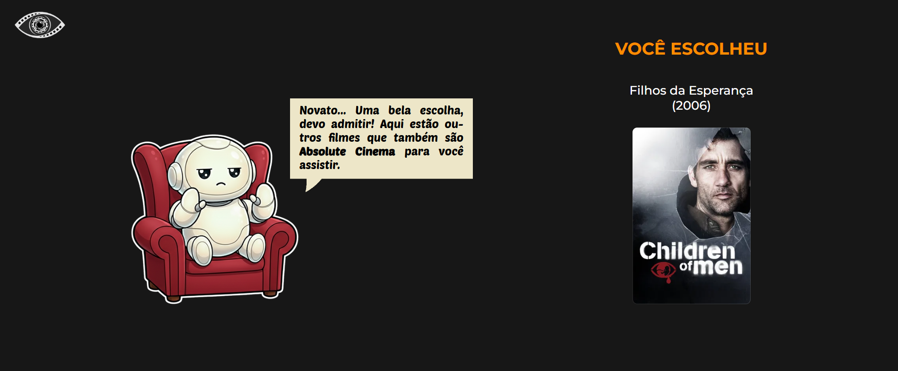
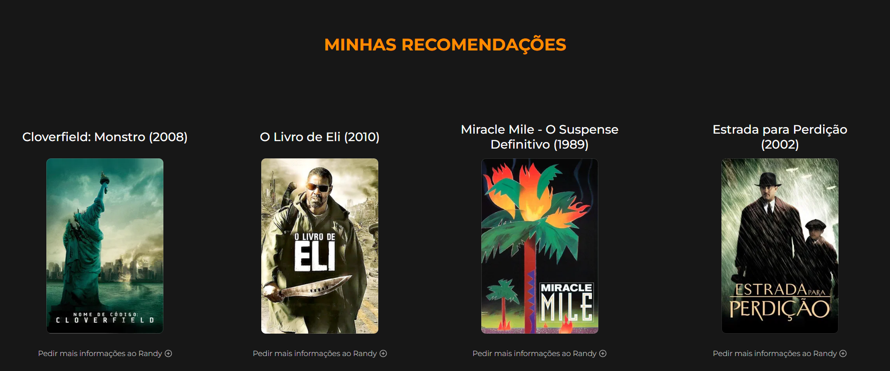
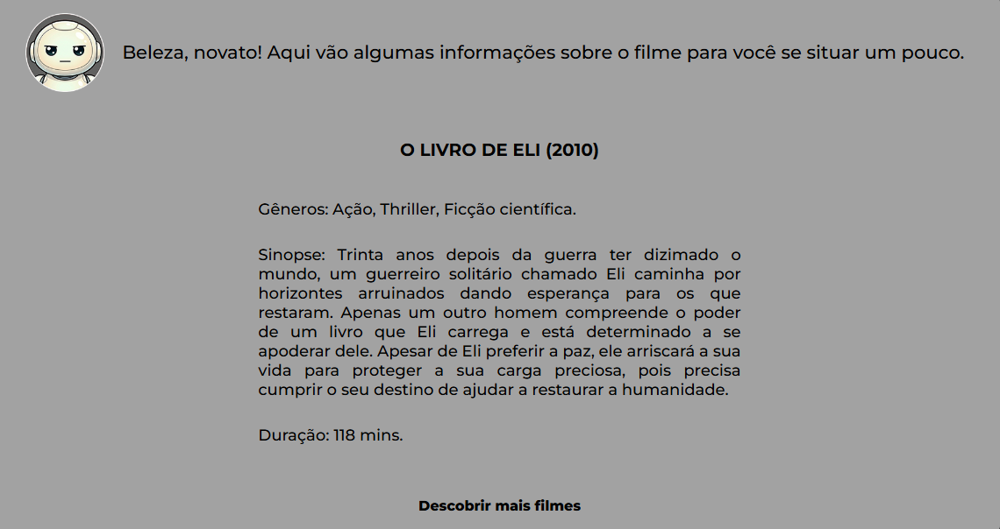

<h1 align="center"> Filmes parecidos com... / filmesparecidos.com </h1>

Site que recomenda filmes parecidos e informações sobre eles, a partir do input de um certo filme escolhido pelo usuário.

  <a href="#-tecnologias">Tecnologias</a>&nbsp;&nbsp;&nbsp;|&nbsp;&nbsp;&nbsp;
  <a href="#-projeto">Projeto</a>&nbsp;&nbsp;&nbsp;|&nbsp;&nbsp;&nbsp;

 

  
  
  
  

## 🚀 Tecnologias

Esse projeto foi desenvolvido com as seguintes tecnologias:

- HTML e CSS
- JavaScript
- Node.js
- Git e Github

## 💻 Projeto

Projeto que usa da API do TMDB para criar um recomendador de filmes semelhantes a um filme de input do usuário. Além de recomendar os filmes, o site dá informações como duração, gêneros e sinopse.
